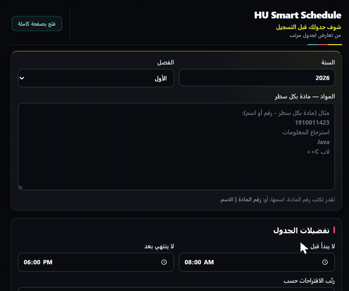
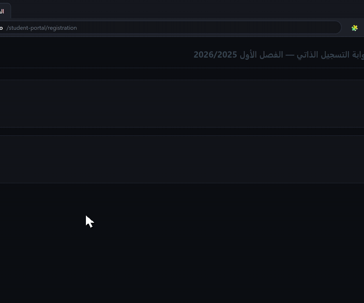
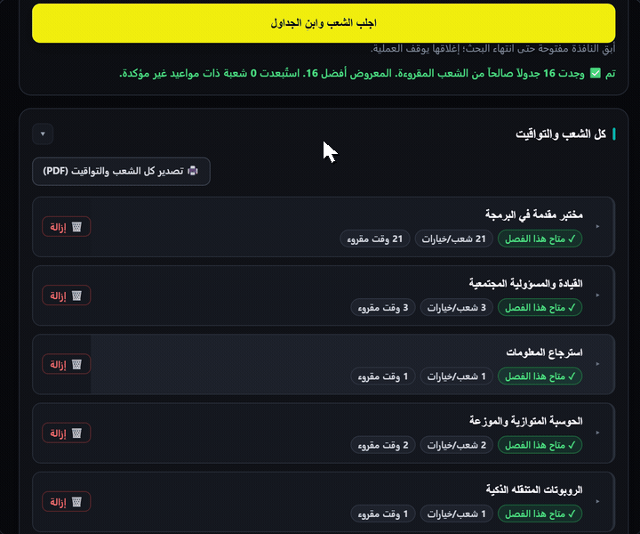
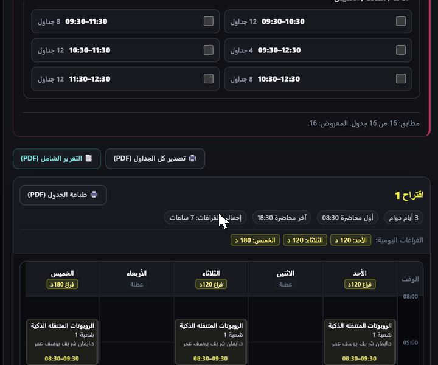
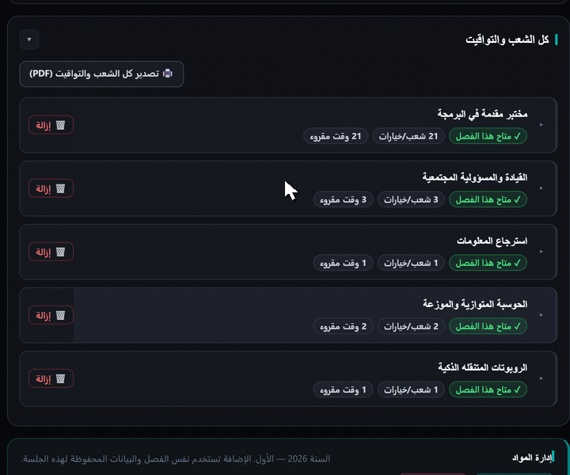
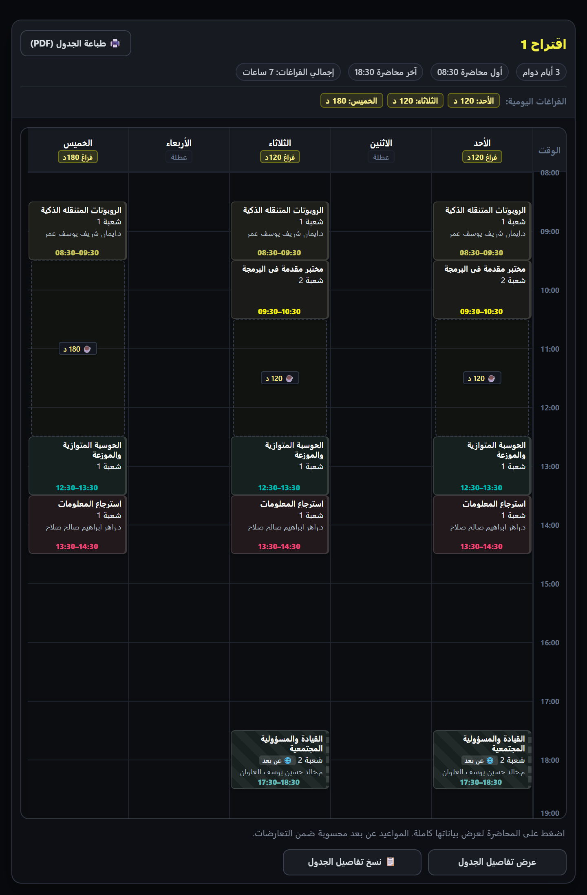
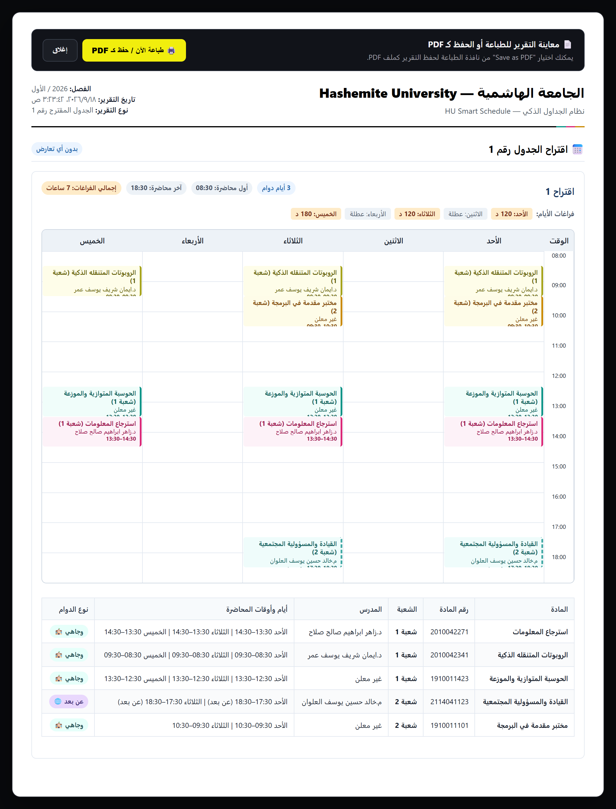

# HU Smart Schedule

**Build smarter university schedules — ابنِ جدولك الجامعي بطريقة أذكى**

A fast course schedule planner with automatic conflict detection, built for Hashemite University students.  
مخطط جداول دراسية سريع مع كشف تلقائي للتعارضات، صُمم خصيصاً لطلبة الجامعة الهاشمية.

  
  
  
  
  

Unofficial student tool — أداة طلابية غير رسمية وليست تابعة أو معتمدة من الجامعة الهاشمية.

---

  

---

## What It Does | ماذا تفعل الإضافة؟

**HU Smart Schedule** helps Hashemite University students plan their course schedules before registration opens by fetching public section data and generating compatible weekly timetable proposals.  
تساعد الإضافة طلبة الجامعة الهاشمية على تنظيم جداولهم الدراسية قبل بدء التسجيل الرسمي، عبر جلب الشعب المعلنة وتوليد اقتراحات جداول أسبوعية متوافقة.

- **Direct University Connection — اتصال مباشر بجريدة المواد:** Fetches public section offerings directly from Hashemite University without requiring student login — جلب الشعب المعلنة مباشرة دون الحاجة لتسجيل الدخول.
- **Smart Search — بحث ذكي:** Search courses by number, name, or supported shorthand — ابحث برقم المادة أو اسمها أو الاختصارات المدعومة.
- **Automatic Conflict Detection — كشف فوري للتعارضات:** Identifies overlapping days and lecture hours immediately — كشف الشعب والأوقات المتداخلة بدقة.
- **Compatible Schedule Proposals — اقتراحات جداول متوافقة:** Generates compatible schedule combinations sorted by fewer campus days, minimal gaps, or preferred times — توليد اقتراحات جداول متوافقة وترتيبها حسب أقل أيام دوام أو الفراغات أو المواعيد.
- **Dynamic Break Filtering — تصفية فترات الاستراحة (Break):** Filter results by preferred free time between campus lectures — فلترة الجداول حسب فترات الفراغ المناسبة بين المحاضرات الوجاهية.
- **Visual Timetable & PDF Export — تقويم أسبوعي وتصدير PDF:** Review schedules on a Sunday–Thursday calendar and print low-ink A4 reports — استعراض الجداول على تقويم أسبوعي وتصدير تقرير جاهز للطباعة.

---

## Search & Preferences | البحث والتفضيلات

Search by course number, name, or supported shorthand — ابحث برقم المادة أو اسمها أو الاختصارات المدعومة.  
Set time bounds, preferred days off, and ranking strategy — حدد حدود وقت المحاضرات، وأيام العطلة المفضلة، وطريقة ترتيب الجداول.

  

- **Course Disambiguation — تحديد المادة المقصودة:** When a search term matches multiple courses, select the intended subject with a single click — عند مطابقة البحث لأكثر من مادة، يمكنك اختيار المادة المقصودة مباشرة.
- **Persistent Course Draft — حفظ تلقائي للمسودة:** Your entered courses and preferences are automatically saved locally across sessions — حفظ تلقائي للمواد والتفضيلات محلياً لاستكمال التخطيط دون فقدان المدخلات.

---

## Sections & Conflicts | الشعب والتعارضات

Inspect every announced section under **"كل الشعب والتواقيت"** to review instructors, lecture times, days, and hall locations — استعرض جميع الشعب المعلنة ومدرسيها ومواعيدها وقاعاتها الدراسية.  
If selected courses overlap, the **"الشعب المتعارضة"** panel shows exactly which sections and times overlap — عند وجود تعارض، تعرض لوحة الشعب المتعارضة المواد والأوقات المتداخلة بدقة.

  

---

## Break-Aware Scheduling | الجداول حسب الاستراحات

Filter generated schedules by preferred Break windows — فلترة الجداول المقترحة حسب فترات الاستراحة (Break) المفضلة بين المحاضرات.  
Selecting a Break updates matching results dynamically — تحديث فوري لعدد ونتائج الجداول المطابقة بمجرد اختيار فترة الاستراحة.

  

- **Sunday / Tuesday / Thursday (STT) Slots:** 1-hour intervals starting from 08:30 — فترات ساعية تبدأ من 08:30 لأيام (ح/ث/خ).
- **Monday / Wednesday (MW) Slots:** 90-minute intervals starting from 08:00 — فترات مدتها 90 دقيقة تبدأ من 08:00 لأيام (ن/ر).
- **Matching Modes:** Match *all* selected breaks across active campus days, or *any* selected break — خيار إلزامية تحقيق *جميع* الاستراحات المحددة أو الاكتفاء بتحقيق *أي* استراحة منها.

<b>Break Calculation Rules | قواعد احتساب فترات الاستراحة</b>

- **In-Person Gap Only:** A Break is defined strictly as free time between consecutive on-campus classes on the same day.
- **Boundary Limits:** Free time before your first campus lecture or after your last lecture does not count as a Break.
- **Remote Courses:** Online / remote lectures do not create or extend campus Break intervals.
- **Off-Days:** Days without on-campus attendance count as off-days rather than campus days.

---

## Course Management | إدارة المواد

Remove a course, add a new one via **"إدارة المواد"**, and continue your current planning workflow without starting over — احذف مادة أو أضف مادة جديدة عبر **"إدارة المواد"** وتابع تخطيط جدولك دون الحاجة للبدء من جديد مع الاحتفاظ بتفضيلاتك.

  

---

## Weekly Calendar | الجدول الأسبوعي

View each proposal in a clear Sunday–Thursday weekly timetable — استعرض كل اقتراح في جدول أسبوعي واضح من الأحد إلى الخميس.

  

- **Sunday–Thursday Columns — أعمدة الأيام:** Full 5-day academic view — عرض كامل لأيام الأسبوع الدراسي من الأحد إلى الخميس.
- **Time Axis — محور التوقيت:** Vertical hourly progression from morning to evening — تسلسل زمني من الصباح حتى المساء.
- **Course Cards — بطاقات المواد:** Clear course title, section number, instructor, and meeting time — بطاقات ملونة توضح اسم المادة والشعبة والمدرس والوقت.
- **Break Indicators — شارات الاستراحة:** Visual badges displaying daily break duration (e.g. `☕ 120 د`) — توضيح مدة الاستراحة اليومية.
- **Off-Day Badges — شارات العطلة:** Distinct badges marking lecture-free days (`عطلة`) — تمييز أيام العطلة من الدوام الوجاهي.
- **Remote Class Badges — شارات المواد عن بعد:** Distinct badges for online lectures (`🌐 عن بعد`) — تمييز المحاضرات الإلكترونية.

---

## PDF Export | تصدير وطباعة PDF

Print or save your timetable as a PDF using your browser's native print workflow — طباعة الجدول أو حفظه كملف PDF عبر نافذة الطباعة في المتصفح.  
Designed with a clean, low-ink A4 layout for physical printing or digital sharing — تصميم أبيض موفر للحبر بحجم A4 مخصص للطباعة أو المشاركة الرقمية.

  

- **Academic Summary — ترويسة وملخص أكاديمي:** Term info, total campus days, start/finish hours, and daily break metrics — معلومات الفصل، وأيام الدوام، ومواعيد البداية والنهاية، وملخص الاستراحات.
- **Complete Course Table — جدول تفصيلي للشعب:** Course numbers, section numbers, instructor names, lecture days, and halls — جدول مرتب يضم أرقام المواد والشعب والمدرسين والأيام والقاعات.
- **Print / Save as PDF — طباعة أو حفظ كملف PDF:** Opens the browser print preview directly ready to print or save — فتح نافذة الطباعة المباشرة للحفظ كـ PDF أو الطباعة الورقية.

---

## Quick Start | طريقة الاستخدام

1. **Open Extension — افتح الإضافة:** Open HU Smart Schedule from the Chrome extensions toolbar.
2. **Choose Term — اختر السنة والفصل:** Select the target academic year and semester.
3. **Enter Courses — أدخل المواد:** Type course numbers, names, or supported shorthand (one per line).
4. **Set Preferences — حدد التفضيلات:** Choose lecture start/end bounds, preferred off-days, and ranking criteria.
5. **Build Schedules — ابنِ الجداول:** Click **"اجلب الشعب وابنِ الجداول"** to fetch sections and generate proposals.
6. **Review Sections & Conflicts — راجع الشعب والتعارضات:** Inspect available sections and resolve overlapping timings.
7. **Filter by Break (optional) — حدد فترات الاستراحة (اختياري):** Select a Break window to filter matching proposals.
8. **Print / Save as PDF — اطبع أو احفظ الجدول:** Click **"طباعة الجدول (PDF)"** to print or save your final timetable.

---

## Installation | التثبيت

### Manual Installation for Google Chrome | التثبيت اليدوي على متصفح كروم

1. Download the latest release ZIP from [GitHub Releases](https://github.com/md3ja/HU-Smart-Schedule-Extension/releases).
2. Extract the downloaded ZIP file to a folder on your computer.
3. Open Google Chrome and navigate to `chrome://extensions`.
4. Turn on **Developer mode** using the toggle in the top-right corner.
5. Click **Load unpacked** (تحميل حزمة غير مضغوطة).
6. Select the extracted extension directory.

---

## Privacy & Permissions | الخصوصية والصلاحيات

HU Smart Schedule uses a privacy-focused architecture with local schedule processing:  
تعتمد الإضافة على معالجة محلية للبيانات وتصميم يركز على خصوصية الطالب:

- **No Student Credentials Required — لا تتطلب تسجيل الدخول:** Never asks for, accesses, or stores student IDs, passwords, or portal credentials — لا تطلب الإضافة أي اسم مستخدم أو كلمة مرور جامعية.
- **Direct HU Public Access — اتصال مباشر بالموقع العام:** Network requests connect strictly to Hashemite University public pages (`https://hu.edu.jo/*`) over encrypted HTTPS to fetch public section offerings — تنحصر الاتصالات الخارجية بطلب صفحات جريدة المواد العامة من موقع الجامعة فقط.
- **No External Backend or Analytics — خالية من الخوادم الخارجية والتتبع:** Zero external backend servers, tracking scripts, or analytics services — لا توجد خوادم وسيطة أو برمجيات تتبع.
- **Local Schedule Processing — معالجة محلية للجداول:** Schedule generation, conflict analysis, ranking, and Break filtering run entirely inside your browser — تجري عمليات توليد الجداول وفحص التعارضات والترتيب محلياً داخل المتصفح.
- **Local Storage Only — تخزين محلي فقط:** The `storage` permission is used strictly on your device to retain course drafts and user preferences — تُستخدم صلاحية التخزين لحفظ مسودة المواد وتفضيلاتك على جهازك فقط.

For more details, see the [Privacy Policy](PRIVACY.md).

---

## Technical Details | التفاصيل التقنية

- **Platform:** Google Chrome Extension (Manifest V3)
- **Frontend:** Pure HTML5, CSS3, and modern JavaScript (zero third-party frameworks)
- **Localization:** Native Arabic Right-to-Left (RTL) interface
- **Processing:** In-browser combinatorial schedule solver and conflict detection
- **Data Source:** Public section data from Hashemite University (`https://hu.edu.jo/*`)

---

## Release | الإصدار

**Prepared for Release | مُجهز للإصدار:** `v1.4.0`

V1.4 highlights — أبرز تحديثات الإصدار:
- Refreshed dark visual theme — واجهة داكنة مريحة ومحدثة
- Improved schedule and calendar readability — وضوح أعلى للتقويم الأسبوعي وبطاقات المواد
- Dynamic Break filtering — فلترة تفاعلية فورية للجداول حسب فترات الاستراحة
- Streamlined course management workflow — إضافة وحذف المواد أثناء التخطيط دون إعادة البدء
- Printable schedule reports — تقارير A4 واضحة وموفرة للحبر للطباعة والحفظ

Previous releases and installation packages are available on [GitHub Releases](https://github.com/md3ja/HU-Smart-Schedule-Extension/releases).

---

## License & Usage | الترخيص وحقوق الاستخدام

© 2026 HU Smart Schedule. All Rights Reserved.  
جميع الحقوق محفوظة © 2026 HU Smart Schedule.

This project is proprietary and is not open source. Unauthorized copying, redistribution, modification, or commercial reuse of the source code or project assets is prohibited.

---

  Built for Hashemite University students — صُممت لطلبة الجامعة الهاشمية

