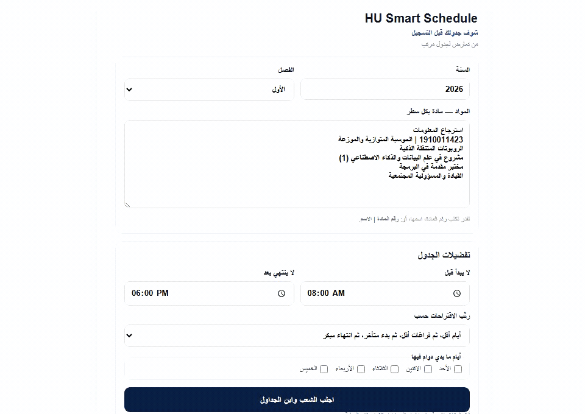
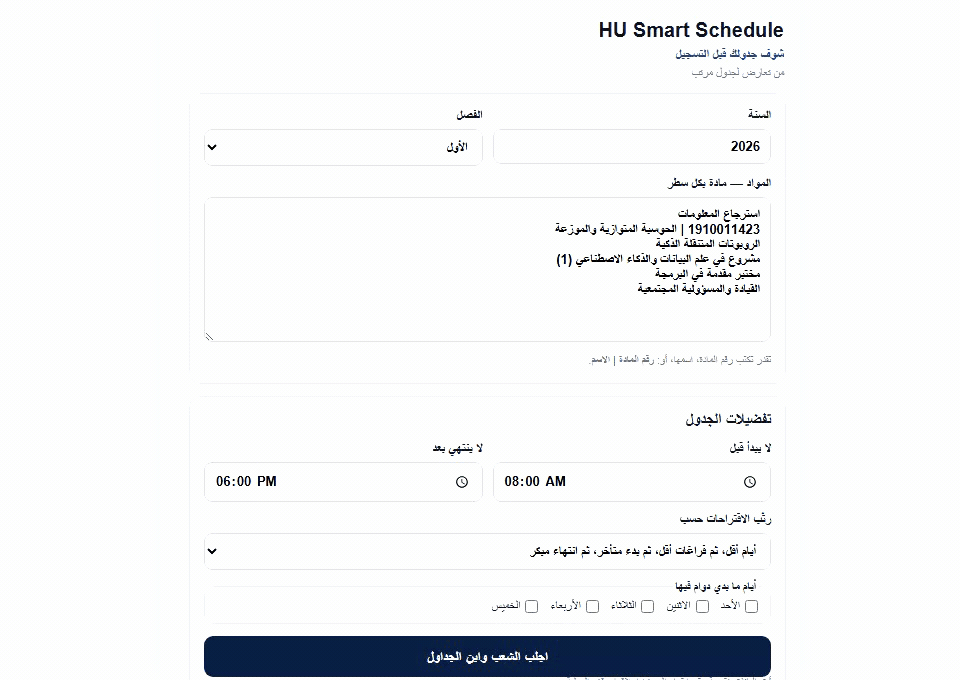
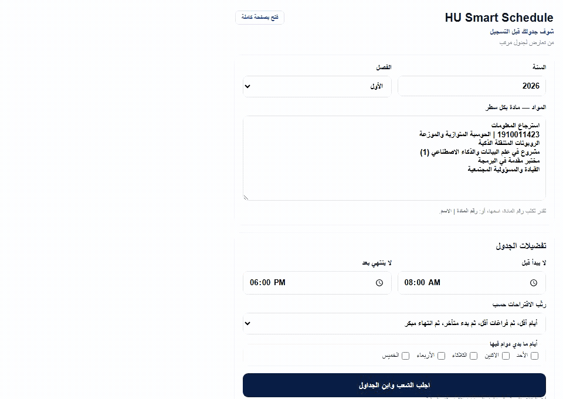

# HU Smart Schedule

### شوف جدولك قبل التسجيل
**من تعارض لجدول مرتب**

 

[English](README.md) | **العربية**

HU Smart Schedule هي إضافة لمتصفح Google Chrome تساعد طلبة الجامعة الهاشمية على استعراض الشعب، اكتشاف التعارضات، وبناء جداول دراسية تناسب تفضيلاتهم.

---

## شوفها وهي تشتغل

أدخل موادك، حدد تفضيلاتك، وخلي HU Smart Schedule يبني لك اقتراحات جداول بدون تعارض.

---

## المميزات

- البحث باسم المادة أو رقمها
- جلب الشعب والمدرسين والأيام والمواعيد المعلنة حاليًا
- اكتشاف التعارضات تلقائيًا
- توليد جداول بدون تعارض
- ترتيب الاقتراحات حسب:
  - أقل أيام دوام
  - أقل Break
  - بداية متأخرة
  - نهاية مبكرة
  - ترتيب متوازن
- عرض أسبوعي من الأحد إلى الخميس
- حساب Break بين المحاضرات الوجاهية المتتالية في نفس اليوم
- احتساب المحاضرات عن بُعد ضمن التعارضات الزمنية
- فتح المخطط بصفحة كاملة
- نسخ معلومات الجدول
- التصدير إلى PDF / Print بحجم A4

---

## البحث السريع عن مادة

ابحث باسم المادة أو رقمها وشاهد الشعب والمدرسين والأيام والمواعيد المتاحة.

---

## كيف تشتغل؟

1. أدخل أسماء المواد أو أرقامها
2. اختر السنة والفصل الدراسي
3. حدد تفضيلات الجدول إن رغبت
4. ولّد الجداول وقارن بين الاقتراحات

تتصل الإضافة مباشرة بصفحات جريدة المواد العامة في موقع الجامعة الهاشمية.

لا حاجة لتسجيل الدخول إلى بوابة الطالب.

---

## طريقة التثبيت

1. نزّل أو استنسخ المستودع إلى جهازك
2. افتح `chrome://extensions`
3. فعّل **Developer mode**
4. اضغط **Load unpacked**
5. اختر مجلد المشروع
6. ثبّت (Pin) أيقونة **HU Smart Schedule** في شريط أدوات Chrome

بعد التثبيت، يمكن فتح الإضافة واستخدامها من أي تبويب عادي في Chrome.

---

## التصدير إلى PDF / Print

صدّر جدولك كتقرير A4 مرتب أو احفظه مباشرة كملف PDF من نافذة الطباعة في Chrome.

---

## ملاحظة مهمة

تعتمد معلومات المواد والشعب على البيانات المعلنة حاليًا من الجامعة الهاشمية وقد تتغير. تأكد دائمًا من التوفر النهائي للشعبة في نظام التسجيل الرسمي قبل التسجيل.

---

## الخصوصية

- لا تطلب الإضافة اسم مستخدم أو كلمة مرور
- لا تجمع معلومات حساب الطالب
- ترسل استعلامات المواد فقط إلى صفحات جريدة المواد العامة في الجامعة الهاشمية
- فحص التعارضات وحساب Break وترتيب وتوليد الجداول يتم محليًا داخل الإضافة

---

## إخلاء مسؤولية

HU Smart Schedule هو مشروع مستقل، ولا يتبع للجامعة الهاشمية، ولا يمثلها رسميًا، ولم يتم اعتماده أو المصادقة عليه من قبل الجامعة.

---

الإصدار: **1.0.1**

Copyright © 2026. All rights reserved.
